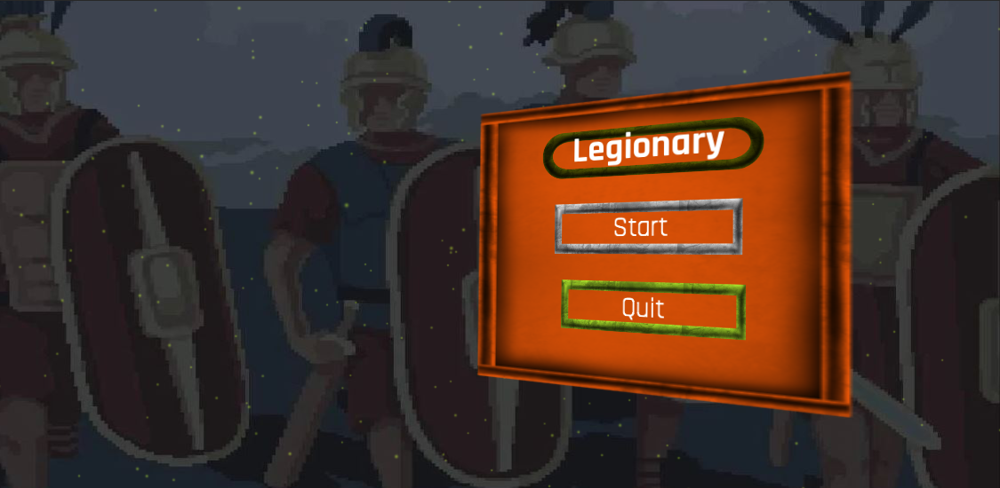
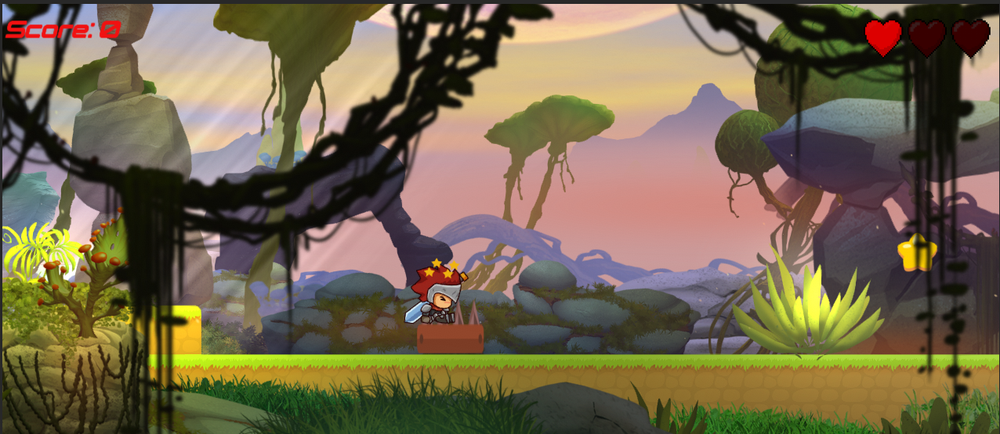
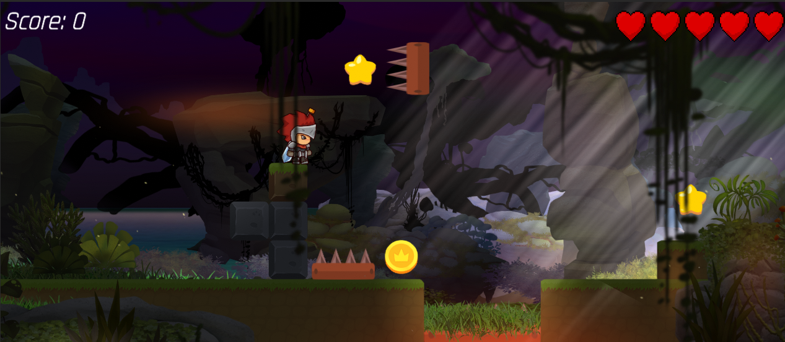
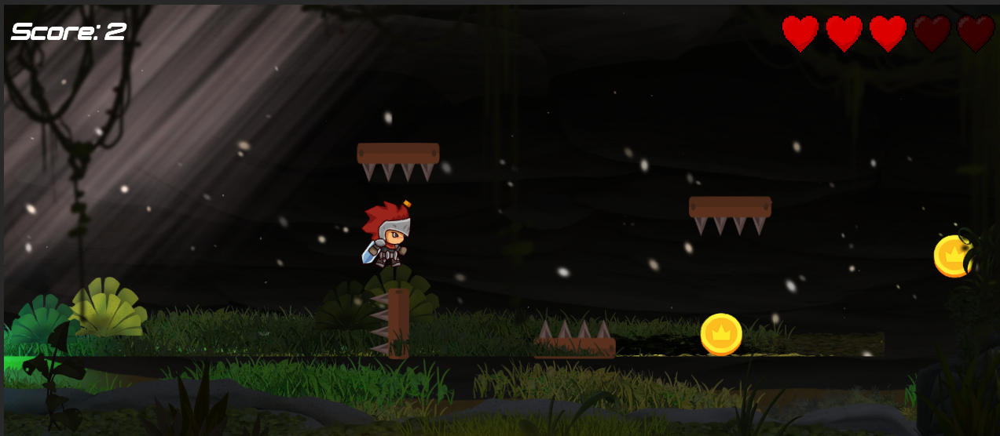

# Legionary ⚔️ <a href="https://youtu.be/WG0DcoSDQ34">Take a look! 👀</a>
Legionary is a 2D platformer game made with `Unity` and `C#`, See screenshots below.  
Feel free to use it as a template or starting point.  
This project targets `macOS`, `Windows`.  
This project can be run on both `Apple Silicon` and `Intel` based Macs.  
Find download links below, there are 2 builds available for download, `Windows x86_64` & `macOS Universal`.

# Features
- Continouse integration build pipeline.
- Activation file generation pipeline.
- Checkpoint system.
- 3 Levels with hazards.
- Win/Lose conditions.
- Main menu, game over & win screen.
- Ambient sound effects & animations.
- Basic 2D player movement.
- basic 2D camera controller.
- Scoring System & Health System.

# Maintenance, Build & Release
| Badge             | Status                           |
|-------------------|----------------------------------|
| Maintenance       |    |
| CI-Build          |                               |              
| Licence               |                     |

# Recommened Specs
## Windows & macOS x86_64
| Specification     | Minimum                          | Recommended                     |
|-------------------|----------------------------------|---------------------------------|
| CPU               | Anything with more than 1 core   | i5-2500K or Ryzen 3 1400        |
| RAM               | 4GB                              | 8GB or higher                   |
| Storage           | 1GB of free space                | 1GB of free sapce               |
| GPU               | Intel UHD 630                    | GT 1030 2GB                     |
| OS                | Windows 10 or macOS 10.12        | Windows 10 or macOS 10.15       |
Unity version       | 2023.1.9f1                       | 2023.1.9f1                      |

# Recommened Specs: Apple Silicon
| Specification     | Minimum                          | Recommended                     |
|-------------------|----------------------------------|---------------------------------|
| CPU               | Apple A12X       | Apple M1                                              |
| RAM               | 6GB                              | 8GB or higher                   |
| Storage           | 1GB of free space                | 1GB of free sapce               |
| GPU               | Apple A12X 7 Core GPU             | Apple M1 7 Core GPU                     |
| OS                | macOS 11        | macOS 13.6 or 14
Unity version       | 2023.1.9f1                       | 2023.1.9f1                      |

~~‼️ Apple silicon isn't supported M1 & M2 SKUs~~  
‼️ Apple silicon now supported 
‼️ Due to some issues with the current version of the unity editor and some dependencies used in the project, WebGL is no longer supported. 

# Downloads
Note: These builds were packaged with `Unity 2023.1.9f1`
- <b>Windows x86_64:</b> [Here](https://www.dropbox.com/scl/fi/ktu62usxhe5llm8c3erun/2D-Platformer-win_x86_64.zip?rlkey=diair3v7ovtvsmjri86zxpgeg&st=sndl5glt&dl=0)
- <b>macOS arm64 `Apple Silicon` & `Intel`:</b> [Here](https://www.dropbox.com/scl/fi/xx43frgsjdb8rze6nyo8p/2D-Platformer-macOS.zip?rlkey=d1zyl9s5q1pox8gpjhukjc20y&st=686w0awz&dl=0)

## Notes
- You may need to allow the app to run on macOS by going to `System Preferences` > `Security & Privacy` > `General` > `Open Anyway`.
- You may need to allow the app to run on Windows by clicking `More Info` > `Run Anyway` when prompted by Windows Defender.

# Screenshots

